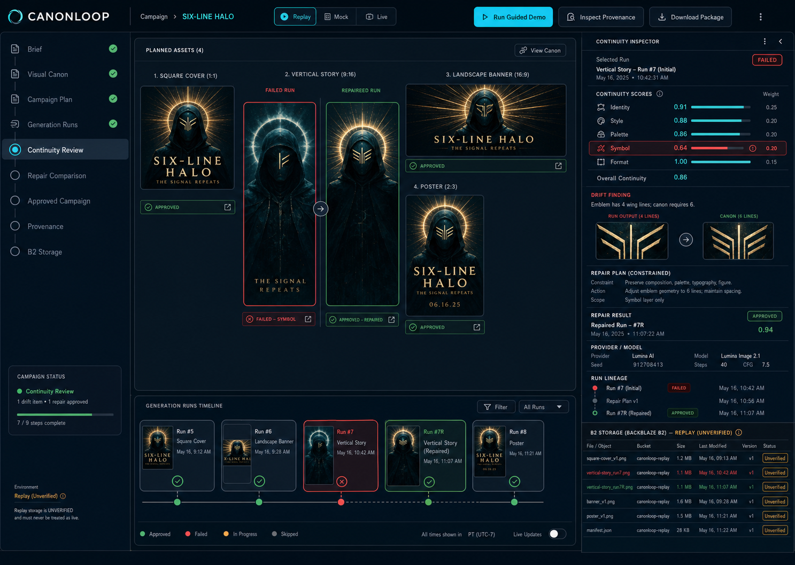
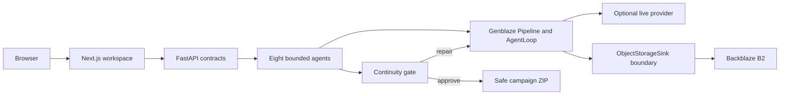

# CANONLOOP

> One visual identity. Every format. No drift.

CANONLOOP is an autonomous continuity director for generative media. It plans a multi-format
campaign, compares every output with an approved Visual Canon, repairs only a failed constraint,
and preserves the complete run lineage as provenance.

**Evidence boundary:** the public guided demo is a deterministic Replay built from synthetic
media. Genblaze `Pipeline`, manifest verification, and a two-iteration `AgentLoop` run locally with
the real Genblaze SDK and `MockProvider`. No external generation provider was called and Backblaze
B2 has not been verified because API credentials were intentionally not supplied.

- Local app: `http://localhost:3000`
- Guided Replay: `http://localhost:3000/demo?scenario=six-line-halo&mode=replay&autoplay=1`
- Hosted demo URL: `NOT DEPLOYED`
- Public repository URL: `https://github.com/estona815/CANONLOOP`
- Public video URL: `NOT UPLOADED`



## Problem and solution

Independent generations drift: faces, masks, clothes, symbols, color, and prompt history change
between a cover, story, banner, and poster. CANONLOOP turns generation into a controlled loop:

1. Intake confirms scope and reference rights.
2. Canon Builder locks identity anchors and mutable attributes.
3. Campaign Planner creates format briefs and bounded retry budgets.
4. Generation uses a Genblaze pipeline boundary.
5. Continuity Critic combines structured evidence with deterministic checks.
6. Repair Agent patches only the failed constraint and links the parent run.
7. Provenance Archivist records assets, manifests, hashes, evaluations, and decisions.
8. Release Packager exports approved assets only.

The eight agents have typed input/output contracts, tool allowlists, failure conditions, retry
policies, and human-approval boundaries in [`services/api/canonloop/agents.py`](services/api/canonloop/agents.py).

## Genblaze

`genblaze-core==0.3.6` is exercised by an automated no-key integration test. It runs a real
`Pipeline` with `fallback_models`, verifies the canonical manifest, then runs an `AgentLoop` for two
iterations. The second run is parent-linked and passes the evaluator. This is SDK integration
evidence—not a claim of live model inference.

## Backblaze B2

B2 is designed as the media system of record. The adapter supports S3-compatible PUT, HEAD, GET,
metadata, and SHA-256 round-trip verification. Object keys separate canon, runs, rejected outputs,
approved outputs, reports, and packages. With no B2 credentials, the UI labels every Replay object
as **unverified** and the submission gate remains closed.

## Architecture



## Modes

| Mode | Provider | Storage | Claim |
| --- | --- | --- | --- |
| Replay | Checked-in synthetic media | Local object index | Deterministic demo evidence |
| Mock | Genblaze `MockProvider` | Fake/injected S3 client | Contract and failure testing |
| Live | Optional provider adapter | Genblaze B2/S3 backend | Disabled until credentials and cost confirmation exist |

## Quick start

Requirements: Python 3.11+, Node 20+, and pnpm 11.

```bash
python3 -m venv .venv
.venv/bin/pip install -e '.[dev]'
pnpm install
pnpm dev
```

In a second terminal:

```bash
PYTHONPATH=services/api .venv/bin/python -m canonloop
```

## Validation

```bash
pnpm lint
pnpm typecheck
pnpm test
pnpm build
PYTHONPATH=services/api .venv/bin/ruff check services/api
PYTHONPATH=services/api .venv/bin/mypy services/api/canonloop
PYTHONPATH=services/api .venv/bin/pytest
PYTHONPATH=services/api .venv/bin/python scripts/submission_readiness.py
```

The readiness command correctly reports `SUBMISSION_NOT_READY` until real provider and B2 evidence
is supplied. It has no force-pass option.

## Security and rights

Secrets stay server-side and are ignored by Git. Upload validation, object-key allowlists, ZIP path
validation, CORS allowlists, prompt limits, retry caps, timeouts, and cost boundaries are documented
in [`SECURITY.md`](SECURITY.md). All demo media is synthetic and generated for this project; see
[`RIGHTS_AND_PROVENANCE.md`](RIGHTS_AND_PROVENANCE.md) and [`ASSET_MANIFEST.json`](ASSET_MANIFEST.json).

## Providers and models

| Path | Provider / model | Status |
| --- | --- | --- |
| Replay contract | Genblaze `MockProvider` / `canonloop-fixture-v1` | Verified locally |
| Live image path | OpenAI adapter / environment-selected model | Not configured or executed |
| B2 storage | Genblaze S3 backend / B2 S3-compatible API | Adapter ready; not verified |

## Known limitations

- No external generation-provider call was made.
- No real B2 object, HEAD result, download, or hash round trip exists.
- Continuity scores are deterministic fixture evidence rather than measurements from a live vision model.
- P0 has no authentication or multi-user tenancy.
- The name is a working project name, not legal trademark clearance.

## License

Code is MIT licensed. Synthetic demo media is included for evaluation and demonstration as recorded
in the asset manifest.
